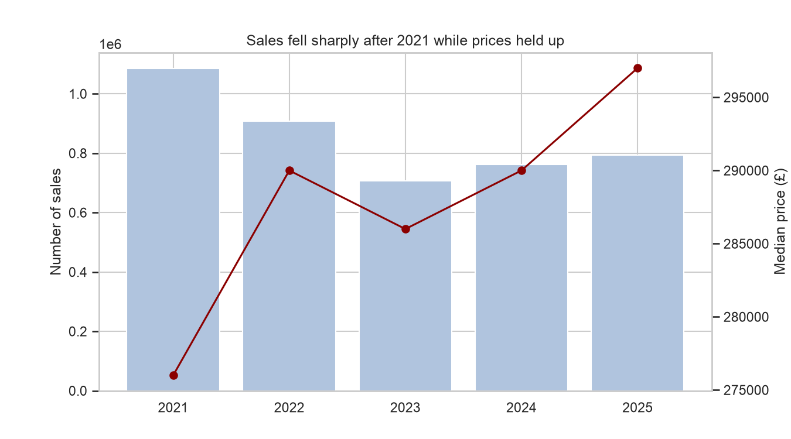
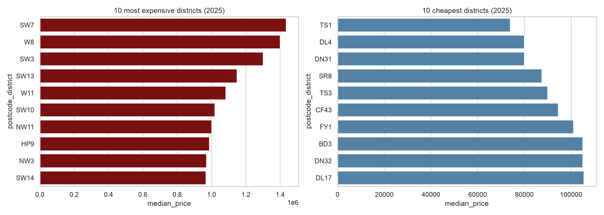
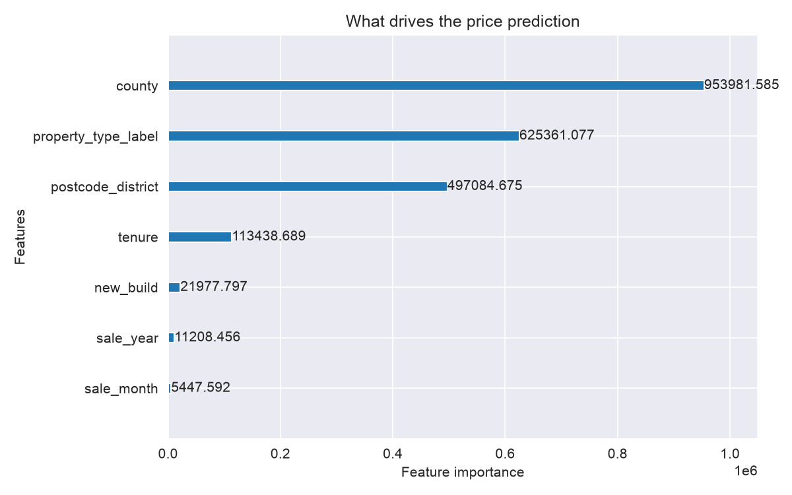

# UK House Price Analysis and Prediction

**Live app:** https://uk-house-prices.streamlit.app/

An end-to-end data project using 4.25 million real property sales from HM Land Registry. I cleaned and analysed the data in PostgreSQL, explored market trends in Python, built and compared three price prediction models, and deployed the best one as an interactive web app.

## Data

- **HM Land Registry Price Paid Data**, England and Wales, 2021–2025
- **4,252,605 sales** after cleaning

### Cleaning decisions
- Kept only standard market sales (category A), removing repossessions, company purchases and other non-standard transactions
- Removed the "Other" property type, which mixes very different kinds of property
- Removed rows with missing postcodes
- Removed extreme prices below £10,000 and above £5 million

## Key findings



- **Sales fell sharply after 2021 while prices held up.** Sales dropped about 35% from 2021 to 2023, after the stamp duty holiday ended and mortgage rates rose, but the median price still rose about 7.6% over the period.
- **Flats barely grew in value.** The median flat rose only from about £237k to £240k in five years, a fall in real terms, while semi-detached homes rose about 11%.
- **Location dominates price.** The most expensive postcode districts (SW7, W8, SW3 in London) have medians around £1.2–1.4m, roughly 19 times the cheapest districts in the North East, Yorkshire and South Wales.
- **March 2025 saw a buying rush** before stamp duty thresholds rose on 1 April, followed by the quietest month of the period.



## Model results (tested on 2025 sales)

The models were trained on 2021–2024 sales and tested on 2025 sales they had never seen, to reflect how a model would be used in practice.

| Model | MAE (£) | MAPE (%) | Median error (%) |
|---|---|---|---|
| Baseline (district + type median) | 94,446 | 25.2 | 18.2 |
| Linear regression | 96,634 | 27.0 | 19.2 |
| LightGBM | 92,417 | 24.9 | 18.0 |

LightGBM performed best, but only slightly outperformed the baseline. Location and property type explain most of the price variation available in this dataset, and both are already used by the baseline.



## Limitations

- The data contains no information about a property's size, number of bedrooms or condition, so the model cannot tell apart very different homes in the same area.
- Tree-based models like LightGBM cannot extrapolate, so predictions reflect recent market prices rather than future growth.
- Estimates are less reliable in districts with few sales.

**Next steps:** add floor area from EPC data, location coordinates and deprivation scores.

## Tools

PostgreSQL · SQL (CTEs, window functions) · Python · pandas · matplotlib · seaborn · scikit-learn · LightGBM · Streamlit · Git

## Project structure

```
sql/              SQL cleaning and analysis queries
01_eda.ipynb      Exploratory analysis and charts
02_model.ipynb    Model training and evaluation
app/              Streamlit app
models/           Trained model files
images/           Charts used in this README
```

## Run locally

```bash
pip install -r app/requirements.txt
python -m streamlit run app/app.py
```